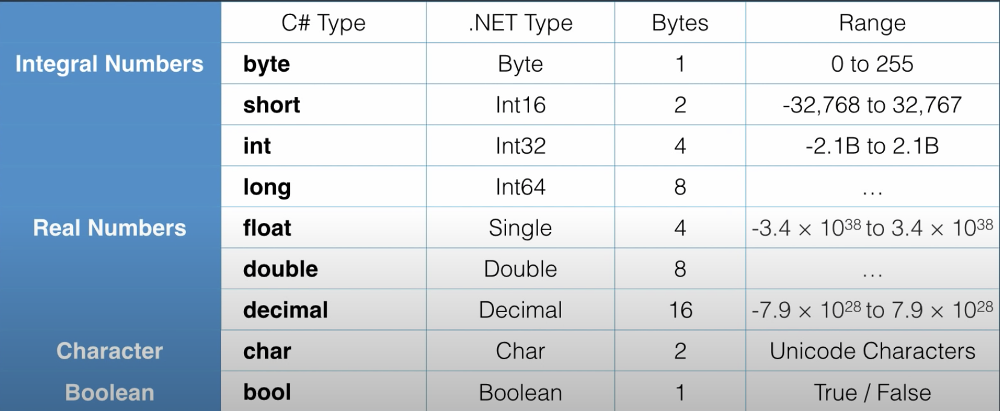

# Basics of C#

## Overview
In this lesson we will cover the basics of a statically typed language, variables, scope and operators.


### Declaring Variables & Constants

C# is a statically typed language which means we need to declare the types of variables when we initialize them. In addition, we need to state the return type when defining a function as well as the types of any parameters passed to the function.

We can choose whether to declare a variable and initialize it later, or declare it and initialize it simultaneously.

```
int number;
int number = 2;
```

We can also declare a variable as a const. A variable marked as const is immutable and is useful therefore for values which don't change such as the speed of light or pi.

```
const double speedOfLight = 299792458;
```

It should be noted that a variable name cannot start with a number. so;
```
1direction
```
would have to be formatted;
```
oneDirection
```
Other naming restrictions include;
- No white space
- No reserved words (such as int)
- By convention, camel case should be used.

### Types

C# uses the following primitive types. There are others but they are rarely used.
A primitive is a data structure that allows you to store only single data type values.
In other words a primitive type has one value (i.e. a number, character, boolean).



As you can see from the table above each type in C# has an equivelant type in the .NET framework. When your code is compiled the C# types will be converted to .NET types.

It is worth noting that double is the deafult value that the compiler will use for a real number. In order to specify that a float (or a decimal) should be used it is neccessary to indicate such in the declaration and the value;
```
float number = 1.2f;
decimal number = 1.2m;
```

### Non-Primitve Types

We will learn more about non-primitive types as we progress through the course. For the moment we'll just note what they are.
- String
- Array
- Enum
- Class


## Scope

In C# variables are block scoped. This means that variables are accessible only within the block of code they are created and any child blocks. For example;

```
static void DisplayMessage()
{
    string day = "Friday";

    if(day == "Friday")
    {
        int hour1 = 5;
        Console.WriteLine(hour1);
        Console.WriteLine(day);
        Console.WriteLine(hour2);
    }
    else if(day == "Saturday")
    {
        int hour2 = 4;
    }
    else
    {
        int hour3 = 7;
    }
}
```

In this example the compiler is perfectly happy priniting day and hour 1 as they are both within scope, however we get an error when we attempt to print hour2.
The hour2 variable exists only within the block it is created (the else if).

## Logging

It is sometimes useful to annotate console logs in order to easily differentiate between them;

```
int hour1 = 5;
int hour2 = 10;
Console.WriteLine("Value of hour1 = " + "{0}", hour1);
Console.WriteLine(
    "Value of hour1 and hour2 = " + "{0}" +" {1}", hour1, hour2);
```

As you can see, we can generate a string with placeholders for our variables as the first parameter. The second (or third or fourth) parameter is the actual value of that variable.


