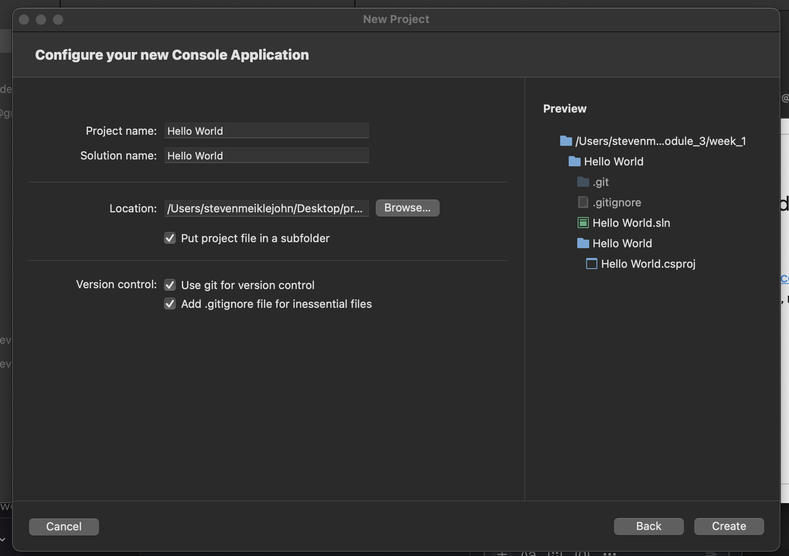

# First Demo App


### Overview

On opening Visual Studio we are met with a range of templates such as desktop, web and cloud that we can use.
For the moment we will work on a console application.
This is basically a command line app with no GUI, this will allow us to familiarise ourselves with some concepts without the need for a front end.
As you know, when we are learning a new language or framework, we are contractually obliged to call our first app 'HelloWorld'. So lets do that.



If you are using the latest version of Visual Studio much of the boilerplate code has been abstracted away. Infact, all you should see in the program.cs is
```
Console.WriteLine("Hello World");
```
We can however add the boilerplate back in (so that we can talk through it) no problem.
```
using System;

namespace HelloWorld
{
    internal class Program
    {
        static void Main(string[] args)
        {
            Console.WriteLine("Hello World");
        }
    }
}
```

As you'll recall, namespace is a collection of classes, in this case our app consists of a single namespace.
If we had multiple namespaces and we wanted to utilize a class from another namespace inside this class we would be required to import it.
This is done via the keyword 'using'.

We are currently 'using' system, which is where our utility classes and primitive types reside.

Every console application we build in visual studio has a class called Program by default.
Inside the Program is our main method. This is the entry point to the application. The method which is executed upon starting the program. We will discuss the details of the terms used in this function a bit later.

Inside the main method we have the actual code for our app/program. At the moment we simply printing "Hello World" to the terminal.


