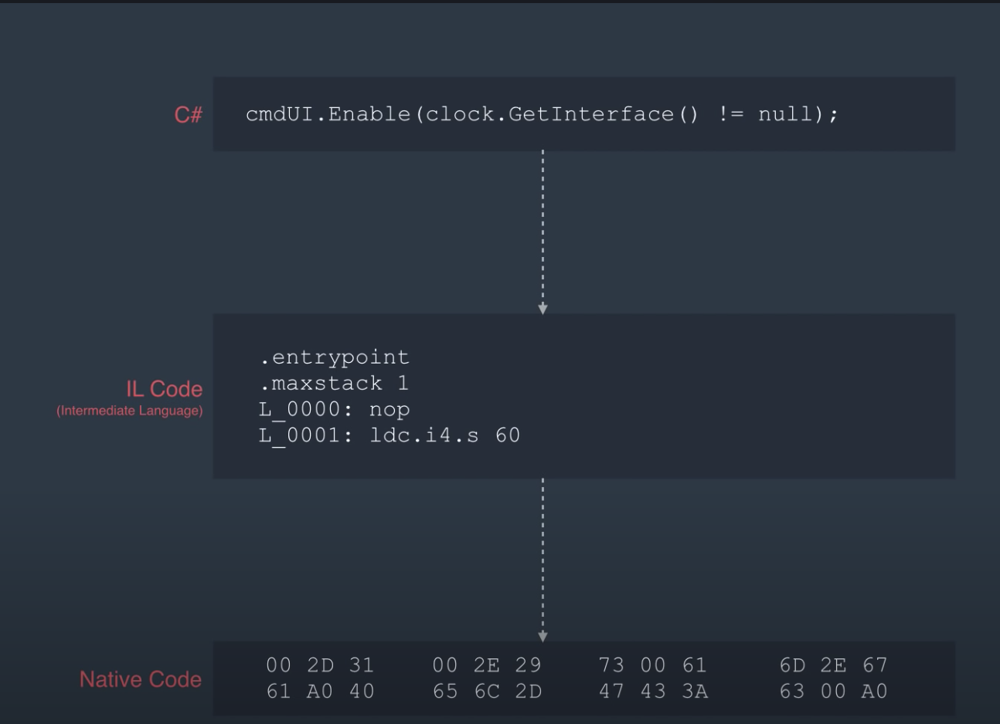
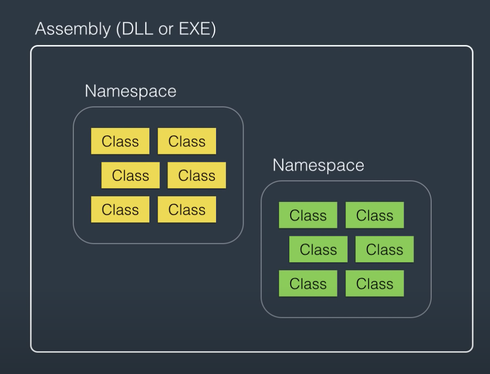
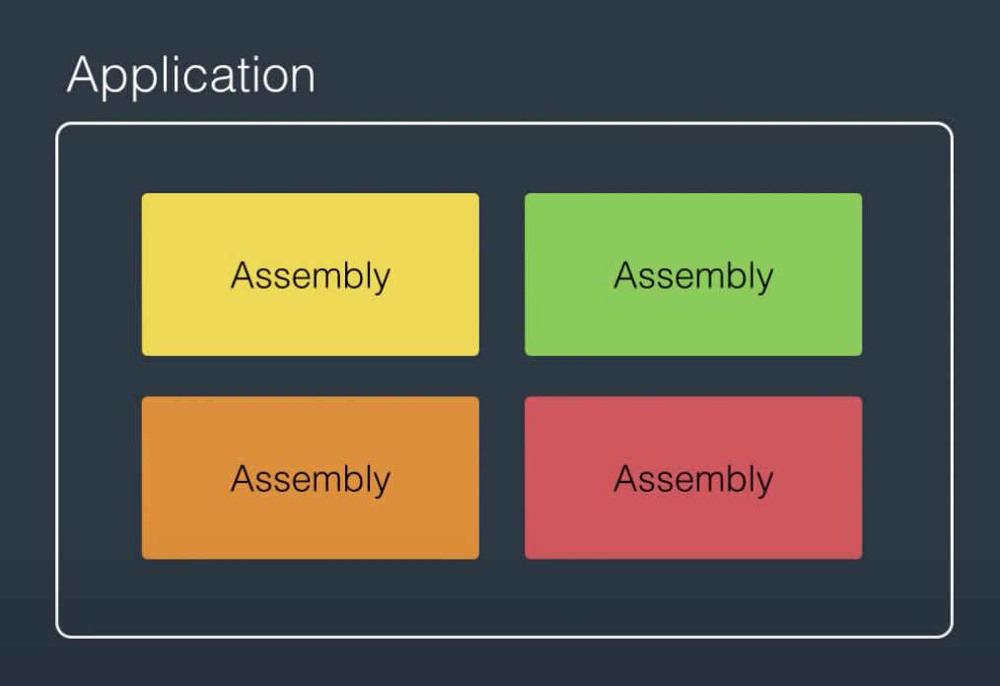

# Introduction to C#.

### Overview

C# vs .Net
CLR (Common Language Runtime)
Architecture of .Net Applications
First C# app.

### C# Vs .Net

One of the most common questions asked when learning C# is 'what is the differnce between C# and .Net?'.
In a nutshell, C# is a programming language while .Net is a framework used for building windows applications. Other languages (such as F#) can be used with the .Net framework.

The .Net framework consists of two components.
1. The CLR (common Language Runtime)
2. Class Library.

Lets look at these in a bit more detail;
1. The CLR

Prior to the invention of C#, languages like C and C++ were compiled into machine code directly. This however meant that the compiled code could not be run a computer using different or a different processor architecture (for example).
With C# it was decided to mirror the strategy employed by Java where the code is converted to IL Code (Intermediate Language Code) which is not tied to a specific architecture or operating system.
The IL Code then needs to be converted to native code appropriate for the system archetecture/operating system. This is the job of the CLR.

So CLR is basically an app that translates architecture agnostic code into hexidecimal or machine code.
This means you can write an application in C# and run it on a Linux machine as long as CLR is installed.

2. Class List

A class in C# works in the same way as it does in Python, Java, even JS. Which is to say, a class is basically a blueprint for creating instances of that class. (Think a cake recipe and a cake or an architectural blueprint and a building).
A class defines the properties that the produced object has as well as any behaviours (methods).
In C# groups of related classes (e.g. related to db interaction or graphics) are grouped into collections called namespaces.
As the complexity of an app grows there could be many namespaces. To group everything together we use an assembly, either in the form of an executable (.exe) of a dll (Dynamic List library).

Its likely that an real life application would have many assemblies, so these are grouped together in an application.

Lets put all this into practice and build a basic app in C#.
To do this we'll be using Visual Studio which is a comprehensive IDE for building in C# (Much like Intellij for Java).

